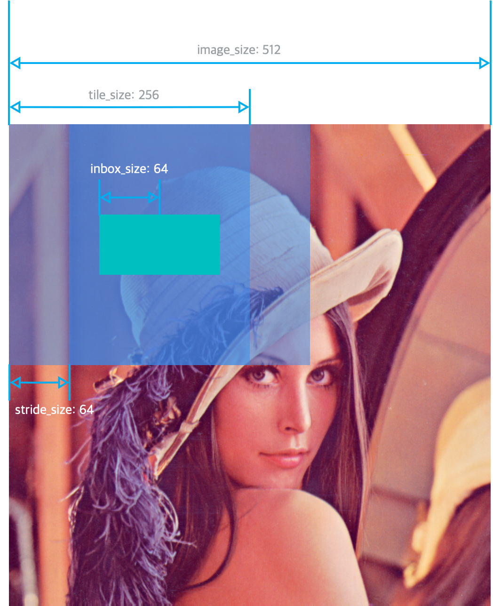

# Image Keras Run

## Docker guide

### Generate docker image

* Build docker

    ```shell
    docker build .
    ```

* Docker image

    ```shell
    docker images

    <none>                  <none>                            53bf6b5d0f6a        44 hours ago        5.2GB
    nvidia/cuda             11.0-cudnn8-runtime-ubuntu18.04   848be2582b0a        12 days ago         3.6GB
    nvidia/cuda             10.2-base                         038eb67e1704        2 weeks ago         107MB
    nvidia/cuda             latest                            752312fac010        3 weeks ago         4.69GB
    nvidia/cuda             10.0-base                         0f12aac8787e        3 weeks ago         109MB
    ```

### Run docker image as container

* Run docker image as bash

    At [This project] folder. (`$(pwd)`)

    ```shell
    docker run \
        --gpus all \
        -it \
        --rm \
        -u $(id -u):$(id -g) \
        -v /etc/localtime:/etc/localtime:ro \
        -v $(pwd):/image-keras \
        -p 6006:6006 \
        --workdir="/image-keras" \
        [image id]
    ```

    Run example.

    ```shell
    docker run \
        --gpus all \
        -it \
        --rm \
        -u $(id -u):$(id -g) \
        -v /etc/localtime:/etc/localtime:ro \
        -v $(pwd):/image-keras \
        -v ~/code/tracking_net:/tracking_net \
        -p 6006:6006 \
        --workdir="/image-keras" \
        d8cb3750b60b
    ```

* (Optional) Or run docker using on shell.

    ```shell
    docker run \
        --gpus all \
        -it \
        --rm \
        -u $(id -u):$(id -g) \
        -v /etc/localtime:/etc/localtime:ro \
        -v $(pwd):/tracking_net \
        -p 6006:6006 \
        --workdir="/tracking_net" \
        [image id] \
        python _run/sample/color_tracking/training_with_generator.py
    ```

* Detach from docker container

    Ctrl+p, Ctrl+q

* Attach to docker container again

    Show running docker containers.

    ```shell
    $ docker ps
    CONTAINER ID        IMAGE               COMMAND             CREATED             STATUS              PORTS               NAMES
    4c25ce8443e6        d59e4204feec        "/bin/bash"         4 hours ago         Up 4 hours                              zen_mendeleev
    ```

    Attach to container 4c25ce8443e6(Container id).

    ```shell
    docker attach 4c25ce8443e6
    docker attach $(docker ps -aq)
    ```

## Slice Image

Slice Image for a image file and a folder contains images.
(Currently, it may be not work for options `not_discard_rest_vertical_tile` and `not_discard_rest_horizontal_tile`)



```shell
python image_keras/run/run_slice_image.py \
    --full_image_path tests/test_resources/lenna.png \
    --tile_size=256 \
    --inbox_size=64 \
    --stride_size=64 \
    --as_gray \
    --target_folder=temp
```

```shell
python image_keras/run/run_slice_image.py \
    --full_image_path tests/test_resources/lenna.png \
    --tile_size=256 \
    --inbox_size=60 \
    --stride_size=60 \
    --add_same_padding \
    --as_gray \
    --target_folder=temp
```

## Resize Image

Resize Image for a image file and a folder contains images.

```shell
python image_keras/run/run_resize_image.py \
    --full_image_path temp/lenna_00_00.png \
    --target_size=128 \
    --target_folder=temp2
```

```shell
python image_keras/run/run_resize_image.py \
    --full_image_path temp \
    --target_size=128 \
    --target_folder=temp3
```

## Black White spaced edge Image

Add spacing between objects then change black white image for a single file and a folder contains images.

```shell
python image_keras/run/run_bw_space_image.py \
    --full_image_path 000.png \
    --edge_size=10 \
    --target_folder=temp
```

```shell
python image_keras/run/run_bw_space_image.py \
    --full_image_path temp2 \
    --edge_size=10 \
    --target_folder=temp3
```

## Mask Image

```shell
python image_keras/run/run_mask_image.py \
    --full_image_path 000.png \
    --mask_bw_image_path 000_mask_with_image.png \
    --target_folder=temp
```

```shell
python image_keras/run/run_mask_image.py \
    --full_image_path temp2 \
    --mask_bw_image_path temp2_mask \
    --target_folder=temp3
```
